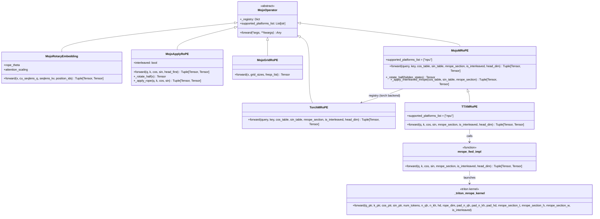

# MRoPE 算子类图



## 模块架构

```
mojo_opset/
├── core/
│   └── operators/
│       └── position_embedding.py  # MojoMRoPE 基类（已合并）
│           ├── MojoRotaryEmbedding
│           ├── MojoApplyRoPE
│           ├── MojoGridRoPE
│           └── MojoMRoPE  ← MRoPE 基类
├── backends/
│   └── ttx/
│       ├── operators/
│       │   └── mrope.py           # TTXMRoPE 后端
│       └── kernels/
│           └── npu/
│               └── mrope.py       # Triton Kernel 实现
└── tests/
    └── accuracy/
        └── operators/
            └── test_mrope.py      # 测试
```

## 类关系

| 关系 | 说明 |
|------|------|
| `MojoOperator <|-- MojoMRoPE` | MojoMRoPE 继承 MojoOperator 基类 |
| `MojoMRoPE <|-- TTXMRoPE` | TTXMRoPE 继承 MojoMRoPE（NPU 后端） |
| `TTXMRoPE --> mrope_fwd_impl` | TTXMRoPE 调用 mrope_fwd_impl |
| `mrope_fwd_impl --> _triton_mrope_kernel` | mrope_fwd_impl 启动 Triton Kernel |

## 平台分发

```
                    ┌─────────────────┐
                    │   MojoMRoPE     │
                    │   (Base Class)  │
                    └────────┬────────┘
                             │
           ┌─────────────────┼─────────────────┐
           │                 │                 │
           ▼                 ▼                 ▼
    ┌────────────┐    ┌────────────┐    ┌────────────┐
    │TorchMRoPE │    │ TTXMRoPE  │    │  ...       │
    │  (PyTorch) │    │   (NPU)   │    │ (Future)   │
    └────────────┘    └─────┬──────┘    └────────────┘
                           │
                           ▼
                   ┌───────────────────┐
                   │  mrope_fwd_impl  │
                   │  (Triton Wrapper) │
                   └─────────┬─────────┘
                             │
                             ▼
                   ┌───────────────────┐
                   │_triton_mrope_kernel│
                   │   (Core Kernel)   │
                   └───────────────────┘
```
