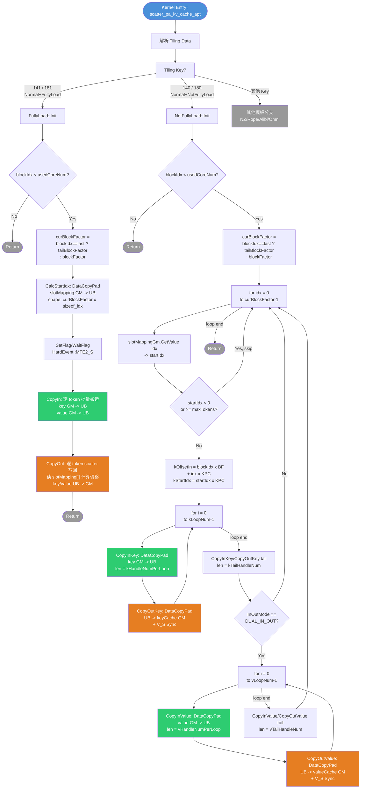

# scatter_pa_kv_cache 算子 arch35 (A5) 深度分析

> 分析目标：华为 CANN 平台 AscendC 算子 `scatter_pa_kv_cache` 的 arch35 (Ascend A5 / 910B/C) 实现
>
> 分析范围：场景二（Normal 模式，scatter_mode="None"），双输入双输出（key + value）
>
> 关键文件：
> - `op_kernel/scatter_pa_kv_cache_apt.cpp` — arch35 kernel 入口
> - `op_kernel/arch35/scatter_pa_kv_cache_normal_fully_load.h` — FullyLoad 子模板
> - `op_kernel/arch35/scatter_pa_kv_cache_normal_not_fully_load.h` — NotFullyLoad 子模板
> - `op_kernel/arch35/common.h` — 公共常量
> - `op_host/scatter_pa_kv_cache_tiling.h` — tiling data 结构定义
> - `op_host/scatter_pa_kv_cache_tiling_arch35.cpp` — tiling 逻辑

---

## 1. 算子 IR — 输入输出规格

### 1.1 场景二（Normal 模式）Tensor 接口

| 参数 | 方向 | Shape | Dtype | 含义 |
|------|------|-------|-------|------|
| `key` | 输入 | `[numTokens, numHead, kHeadSize]` | fp16 / bf16 / fp32 / int8 等 | 当前 step 各 token 的 key 值 |
| `value` | 输入 | `[numTokens, numHead, vHeadSize]` | 同 key dtype | 当前 step 各 token 的 value 值 |
| `keyCache` | 输入/输出 | `[numBlocks, blockSize, numHead, kHeadSize]` | 同 key dtype | KV Cache 的 key 存储（原地更新） |
| `valueCache` | 输入/输出 | `[numBlocks, blockSize, numHead, vHeadSize]` | 同 value dtype | KV Cache 的 value 存储（原地更新） |
| `slotMapping` | 输入 | `[numTokens]` | int32 / int64 | 每个 token 在 cache 中的**一维线性偏移**（slot 编号） |

### 1.2 约束条件

1. **dtype 一致性**：key、value、keyCache、valueCache 必须使用相同 dtype（Normal 模式下）
2. **slotMapping dtype**：仅支持 int32 或 int64
3. **cacheMode 属性**：必须为 `"Norm"`
4. **scatter_mode 属性**：必须为 `"None"` 或 `""`
5. **key 维度**：必须是 3D `[numTokens, numHead, kHeadSize]`
6. **有效 slot 范围**：`slotMapping[i] ∈ [0, numBlocks × blockSize)`，若 `slotMapping[i] < 0` 则跳过该 token
7. **kHeadSize 与 vHeadSize**：可以不同
8. **fp4 特殊约束**：当 dtype 为 fp4 时，kHeadSize 和 vHeadSize 必须为偶数

### 1.3 slotMapping 的语义

`slotMapping` 是一个长度为 `numTokens` 的一维索引数组。对于第 `i` 个 token：
- `slotMapping[i]` 给出该 token 的 key/value 数据在 `keyCache`/`valueCache` 中的**一维线性偏移**
- 在 cache 中的实际写入位置 = `slotMapping[i] * (numHead × headSize)`（以元素为单位）
- 这等价于将 `[numBlocks, blockSize, numHead, headSize]` 的后三维展平后的偏移
- 当 `slotMapping[i] < 0` 时，表示该 token 不需要写入 cache（padding token），直接跳过

### 1.4 输入输出模式

arch35 kernel 使用 `InOutMode = DUAL_IN_OUT (= 2)`，即同时处理 key 和 value 的 scatter 写入。

---

## 2. 数学公式

### 2.1 核心操作

scatter_pa_kv_cache 的本质是一个 **scatter-write** 操作，将每个 token 的 key/value 数据写入 KV Cache 的指定位置。

$$
\text{keyCache}[\text{slotMapping}[t] \cdot H \cdot D_k + h \cdot D_k + d] \leftarrow \text{key}[t, h, d]
$$

$$
\text{valueCache}[\text{slotMapping}[t] \cdot H \cdot D_v + h \cdot D_v + d] \leftarrow \text{value}[t, h, d]
$$

其中：
- $t \in [0, N)$ 为 token 索引，$N = \text{numTokens}$
- $h \in [0, H)$ 为注意力头索引，$H = \text{numHead}$
- $d \in [0, D_k)$ 为 key 的 headDim 维度，$D_k = \text{kHeadSize}$
- $d \in [0, D_v)$ 为 value 的 headDim 维度，$D_v = \text{vHeadSize}$

### 2.2 条件跳过

$$
\text{if } \text{slotMapping}[t] < 0 \text{ or } \text{slotMapping}[t] \geq \text{numBlocks} \times \text{blockSize}: \quad \text{skip token } t
$$

### 2.3 一维展平视角

将 keyCache 的 shape `[numBlocks, blockSize, numHead, kHeadSize]` 展平为 `[numBlocks × blockSize × numHead × kHeadSize]`：

$$
\text{flatKeyCache}[\text{slot}[t] \times K_{perToken}] \leftarrow \text{key}[t, :, :]
$$

其中 $K_{perToken} = H \times D_k = \text{numHead} \times \text{kHeadSize}$ 是一个 token 的 key 数据量（元素数）。

同理：

$$
\text{flatValueCache}[\text{slot}[t] \times V_{perToken}] \leftarrow \text{value}[t, :, :]
$$

其中 $V_{perToken} = H \times D_v$。

---

## 3. Tiling 切分逻辑

### 3.1 多核切分（Token 维度）

算子沿 **token 维度**（axis=0）切分，分配到多个 AI Core 并行执行。

```
blockFactor = ceil(numTokens / totalCoreNum)
usedCoreNum = min(ceil(numTokens / blockFactor), totalCoreNum)
tailBlockFactor = numTokens - blockFactor × (usedCoreNum - 1)
```

| 参数 | 公式 | 含义 |
|------|------|------|
| `totalCoreNum` | 平台查询（`GetCoreNumAiv()`） | 芯片可用 AI Core 数 |
| `blockFactor` | `ceil(N / totalCoreNum)` | 每个 core 处理的 token 数 |
| `usedCoreNum` | `min(ceil(N / blockFactor), totalCoreNum)` | 实际使用的 core 数 |
| `tailBlockFactor` | `N - blockFactor × (usedCoreNum - 1)` | 最后一个 core 的 token 数（可能更少） |

**切分示意**：

```
Token 维度:  |--- blockFactor ---|--- blockFactor ---|--- tailBlockFactor ---|
             Core 0              Core 1              Core (usedCoreNum-1)
```

### 3.2 每个 Token 的数据处理量

```
kHandleNumPerCore = numHead × kHeadSize    // 一个 token 的 key 元素数
vHandleNumPerCore = numHead × vHeadSize    // 一个 token 的 value 元素数
```

### 3.3 UB 切分（headDim × numHead 维度切分）— NotFullyLoad 模式

当 `kHandleNumPerCore` 的数据量超过 UB 容量时，需要将每个 token 的数据分多轮 loop 搬运。

```
maxHandleNumPerLoop = ubSize / dtypeByteSize                    // UB 能容纳的最大元素数
kHandleNumPerLoop = (ubSize - RESERVED_UB_SIZE) / dtypeByteSize / 2   // 每轮 loop UB 能装的元素数
kLoopNum = ceil(kHandleNumPerCore / kHandleNumPerLoop)          // key 的主循环次数
kTailHandleNum = kHandleNumPerCore - kLoopNum × kHandleNumPerLoop  // key 的尾部数据量
kLoopNum = kLoopNum - 1                                         // 扣除尾部后主循环次数
```

> **注意**：`RESERVED_UB_SIZE = 2KB` 是预留空间。除以 2 是因为队列机制（Queue bind 需要 double buffer 或预留额外空间）。

### 3.4 FullyLoad vs NotFullyLoad 判定阈值

```
ubThreshold = max(blockFactor, tailBlockFactor) ×
                (RoundUp(kHandleNumPerCore) + RoundUp(vHandleNumPerCore)) +
              RoundUp(max(blockFactor, tailBlockFactor)) × 2 × indexDtypeSize / dtypeByteSize
```

其中 `RoundUp(x)` 向上对齐到 `32 / dtypeByteSize`（一个 UB block 的元素数）。

```
if ubThreshold <= maxHandleNumPerLoop:
    isFullyLoad = FULLY_LOAD (1)    // UB 足以一次装载所有 token 的全部数据
else:
    isFullyLoad = NOT_FULLY_LOAD (0) // 需要分 loop
```

**直觉**：FullyLoad 要求 UB 能同时容纳 `max(blockFactor, tailBlockFactor)` 个 token 的 key + value + slotMapping 数据。

### 3.5 Tiling Key 生成

```cpp
tilingKey = templateType × 100 + indexDtypeSize × 10 + isFullyLoad
// Normal 模式下：
//   templateType = 1
//   indexDtypeSize = 4 (int32) 或 8 (int64)
//   isFullyLoad = 0 或 1
//
// Normal + int32 + FullyLoad      → 141
// Normal + int32 + NotFullyLoad   → 140
// Normal + int64 + FullyLoad      → 181
// Normal + int64 + NotFullyLoad   → 180
```

### 3.6 Tiling 数据字段总表

| 字段 | 类型 | 含义 |
|------|------|------|
| `usedCoreNum` | int64 | 实际使用的 AI Core 数 |
| `blockFactor` | int64 | 每个 core 的 token 数 |
| `tailBlockFactor` | int64 | 最后一个 core 的 token 数 |
| `kHandleNumPerCore` | int64 | 每个 token 的 key 元素数 (`numHead × kHeadSize`) |
| `vHandleNumPerCore` | int64 | 每个 token 的 value 元素数 (`numHead × vHeadSize`) |
| `kLoopNum` | int64 | key 的主循环次数（NotFullyLoad） |
| `vLoopNum` | int64 | value 的主循环次数（NotFullyLoad） |
| `kHandleNumPerLoop` | int64 | key 每轮 loop 处理的元素数 |
| `vHandleNumPerLoop` | int64 | value 每轮 loop 处理的元素数 |
| `kTailHandleNum` | int64 | key 尾部循环处理的元素数 |
| `vTailHandleNum` | int64 | value 尾部循环处理的元素数 |
| `numHead` | int64 | 注意力头数 |
| `kHeadSize` | int64 | key 的 headDim |
| `vHeadSize` | int64 | value 的 headDim |
| `numBlocks` | int64 | cache block 数量 |
| `blockSize` | int64 | 每个 block 的 slot 数量 |
| `ubSize` | int64 | 可用 UB 大小（字节） |

---

## 4. 算子计算逻辑伪代码

### 4.1 Kernel 入口（scatter_pa_kv_cache_apt.cpp）

```
kernel scatter_pa_kv_cache(key, keyCacheIn, slotMapping, value, valueCacheIn,
                           compressLens, compressSeqOffset, seqLens,
                           keyCacheOut, valueCacheOut, workspace, tiling):
    pipe = TPipe()
    tilingData = GET_TILING_DATA(tiling)
    KERNEL_TASK_TYPE_DEFAULT(KERNEL_TYPE_AIV_ONLY)

    switch tilingData.tilingKey:
        case 141:  // Normal + int32 + FullyLoad
            op = ScatterPaKvCacheNormalFullyLoad<T, int32, DUAL_IN_OUT>(pipe, tilingData)
            op.Init(...)
            op.Process()
        case 140:  // Normal + int32 + NotFullyLoad
            op = ScatterPaKvCacheNormalNotFullyLoad<T, int32, DUAL_IN_OUT>(pipe, tilingData)
            op.Init(...)
            op.Process()
        case 181:  // Normal + int64 + FullyLoad
            op = ScatterPaKvCacheNormalFullyLoad<T, int64, DUAL_IN_OUT>(pipe, tilingData)
            op.Init(...)
            op.Process()
        case 180:  // Normal + int64 + NotFullyLoad
            op = ScatterPaKvCacheNormalNotFullyLoad<T, int64, DUAL_IN_OUT>(pipe, tilingData)
            op.Init(...)
            op.Process()
```

### 4.2 FullyLoad 分支（ScatterPaKvCacheNormalFullyLoad）

**适用条件**：UB 足以一次装载 `blockFactor` 个 token 的全部 key + value + slotMapping 数据。

```
// ─── Init ───
function Init(key, keyCacheIn, slotMapping, value, valueCacheIn, ...):
    blockIdx = GetBlockIdx()
    blockFactorOffset = blockIdx × tiling.blockFactor

    inputKeyGm    ← key          (GM 地址绑定)
    slotMappingGm ← slotMapping + blockIdx × tiling.blockFactor  (偏移到本 core 的 slotMapping 区域)
    outputKeyCacheGm ← keyCacheOut

    maxBlockFactor = max(tiling.blockFactor, tiling.tailBlockFactor)

    // UB 分配：一次能装载所有 token 的 key 数据
    pipe.InitBuffer(kSlotMappingBuf,  RoundUp(maxBlockFactor) × sizeof(IndexDtype))
    pipe.InitBuffer(inputKeyQueue,    1, maxBlockFactor × RoundUp(tiling.kHandleNumPerCore) × sizeof(T))

    if InOutMode == DUAL_IN_OUT:
        inputValueGm ← value
        outputValueCacheGm ← valueCacheOut
        pipe.InitBuffer(vSlotMappingBuf, RoundUp(maxBlockFactor) × sizeof(IndexDtype))
        pipe.InitBuffer(inputValueQueue,  1, maxBlockFactor × RoundUp(tiling.vHandleNumPerCore) × sizeof(T))

    maxTokens = tiling.numBlocks × tiling.blockSize


// ─── Process ───
function Process():
    if blockIdx >= tiling.usedCoreNum:
        return  // 多余的 core 直接退出

    curBlockFactor = (blockIdx == tiling.usedCoreNum - 1)
                     ? tiling.tailBlockFactor
                     : tiling.blockFactor

    // Step 1: 从 GM 加载 slotMapping 到 UB
    slotMappingLocal = kSlotMappingBuf.Get<IndexDtype>()
    CalcStartIdx(slotMappingLocal, curBlockFactor, tiling.kHandleNumPerCore)
    // → DataCopyPad(slotMappingLocal, slotMappingGm_, {1, curBlockFactor×sizeof(IndexDtype)})

    if InOutMode == DUAL_IN_OUT:
        vSlotMappingLocal = vSlotMappingBuf.Get<IndexDtype>()
        CalcStartIdx(vSlotMappingLocal, curBlockFactor, tiling.vHandleNumPerCore)

    // 同步事件 MTE2→S（确保 slotMapping 加载完成）
    SetFlag<HardEvent::MTE2_S>(eventId)
    WaitFlag<HardEvent::MTE2_S>(eventId)

    // Step 2: CopyIn — 将所有 token 的 key/value 从 GM 搬入 UB
    CopyIn(curBlockFactor)

    // Step 3: CopyOut — 根据 slotMapping scatter 写回 GM
    CopyOut(curBlockFactor)


// ─── CopyIn ───
// shape: GM key [numTokens, numHead, kHeadSize] → UB inputKeyLocal [curBlockFactor × RoundUp(kHandleNumPerCore)]
function CopyIn(curBlockFactor):
    inputKeyLocal = inputKeyQueue.AllocTensor<T>()

    for i = 0 to curBlockFactor - 1:
        kOffsetIn = (blockFactorOffset + i) × tiling.kHandleNumPerCore
        // → GM偏移: 第(blockFactorOffset+i)个token的key数据起始
        // shape视角: key[blockFactorOffset+i, :, :] → 展平为 kHandleNumPerCore 个元素
        DataCopyPad(inputKeyLocal[i × RoundUp(tiling.kHandleNumPerCore)],
                    inputKeyGm[kOffsetIn],
                    {1, kHandleNumPerCore × sizeof(T)})

    inputKeyQueue.EnQue(inputKeyLocal)

    if InOutMode == DUAL_IN_OUT:
        inputValueLocal = inputValueQueue.AllocTensor<T>()
        for i = 0 to curBlockFactor - 1:
            vOffsetIn = (blockFactorOffset + i) × tiling.vHandleNumPerCore
            DataCopyPad(inputValueLocal[i × RoundUp(tiling.vHandleNumPerCore)],
                        inputValueGm[vOffsetIn],
                        {1, vHandleNumPerCore × sizeof(T)})
        inputValueQueue.EnQue(inputValueLocal)


// ─── CopyOut ───
// shape: UB inputKeyLocal [curBlockFactor × RoundUp(kHandleNumPerCore)] → GM keyCache[slotMapping[i] × kHandleNumPerCore]
function CopyOut(curBlockFactor):
    inputKeyLocal = inputKeyQueue.DeQue<T>()
    kSlotMappingLocal = kSlotMappingBuf.Get<IndexDtype>()

    for i = 0 to curBlockFactor - 1:
        kStartIdx = kSlotMappingLocal.GetValue(i)       // 读取 slot 偏移
        if kStartIdx < 0 or kStartIdx >= maxTokens:
            continue                                     // 无效 slot，跳过
        kStartIdx = kStartIdx × tiling.kHandleNumPerCore // 转换为元素偏移
        DataCopyPad(outputKeyCacheGm[kStartIdx],
                    inputKeyLocal[i × RoundUp(tiling.kHandleNumPerCore)],
                    {1, kHandleNumPerCore × sizeof(T)})

    inputKeyQueue.FreeTensor(inputKeyLocal)

    if InOutMode == DUAL_IN_OUT:
        inputValueLocal = inputValueQueue.DeQue<T>()
        vSlotMappingLocal = vSlotMappingBuf.Get<IndexDtype>()
        for i = 0 to curBlockFactor - 1:
            vStartIdx = vSlotMappingLocal.GetValue(i)
            if vStartIdx < 0 or vStartIdx >= maxTokens:
                continue
            vStartIdx = vStartIdx × tiling.vHandleNumPerCore
            DataCopyPad(outputValueCacheGm[vStartIdx],
                        inputValueLocal[i × RoundUp(tiling.vHandleNumPerCore)],
                        {1, vHandleNumPerCore × sizeof(T)})
        inputValueQueue.FreeTensor(inputValueLocal)
```

**FullyLoad 数据流 Shape 变化**：

```
GM key:              [numTokens, numHead, kHeadSize]  (展平视角)
                         ↓ 按 (blockFactorOffset+i) × kHandleNumPerCore 偏移
UB inputKeyLocal:    [curBlockFactor, RoundUp(kHandleNumPerCore)]
                         ↓ 按 slotMapping[i] × kHandleNumPerCore 偏移 scatter
GM keyCache:         [numBlocks, blockSize, numHead, kHeadSize]  (展平视角)
```

### 4.3 NotFullyLoad 分支（ScatterPaKvCacheNormalNotFullyLoad）

**适用条件**：UB 不够一次装载一个 token 的全部 `numHead × headSize` 数据，需要沿 `numHead × headSize` 维度切分为多轮 loop。

```
// ─── Init ───
function Init(key, keyCacheIn, slotMapping, value, valueCacheIn, ...):
    blockIdx = GetBlockIdx()
    blockFactorOffset = blockIdx × tiling.blockFactor

    keyGm          ← key
    slotMappingGm  ← slotMapping + blockIdx × tiling.blockFactor
    keyCacheOutGm  ← keyCacheOut

    kMaxHandleNumPerLoop = max(tiling.kHandleNumPerLoop, tiling.kTailHandleNum)
    pipe.InitBuffer(keyQueue, 1, RoundUp(kMaxHandleNumPerLoop) × sizeof(T))

    if InOutMode == DUAL_IN_OUT:
        valueGm ← value
        valueCacheOutGm ← valueCacheOut
        vMaxHandleNumPerLoop = max(tiling.vHandleNumPerLoop, tiling.vTailHandleNum)
        pipe.InitBuffer(valueQueue, 1, RoundUp(vMaxHandleNumPerLoop) × sizeof(T))

    maxTokens = tiling.numBlocks × tiling.blockSize


// ─── Process ───
// 外层循环: 逐 token 处理
// 内层循环: 逐 loop 处理每个 token 的 key/value 数据
function Process():
    if blockIdx >= tiling.usedCoreNum:
        return

    curBlockFactor = (blockIdx == tiling.usedCoreNum - 1)
                     ? tiling.tailBlockFactor
                     : tiling.blockFactor

    for idx = 0 to curBlockFactor - 1:        // ← 外层: 逐 token
        // ── 读取 slot 偏移 ──
        kOffsetIn = (blockFactorOffset + idx) × tiling.kHandleNumPerCore  // GM 输入偏移
        startIdx = slotMappingGm.GetValue(idx)   // 直接从 GM 读 slotMapping
        if startIdx < 0 or startIdx >= maxTokens:
            continue
        kStartIdx = startIdx × tiling.kHandleNumPerCore  // GM 输出偏移

        // ── Key 主循环 (kLoopNum 轮) ──
        for i = 0 to tiling.kLoopNum - 1:     // ← 内层: 逐 loop
            CopyInKey(i, kOffsetIn, tiling.kHandleNumPerLoop)
            CopyOutKey(i, kStartIdx, tiling.kHandleNumPerLoop)

        // ── Key 尾部 (1 轮) ──
        CopyInKey(tiling.kLoopNum, kOffsetIn, tiling.kTailHandleNum)
        CopyOutKey(tiling.kLoopNum, kStartIdx, tiling.kTailHandleNum)

        // ── Value (同样逻辑) ──
        if InOutMode == DUAL_IN_OUT:
            vOffsetIn = (blockFactorOffset + idx) × tiling.vHandleNumPerCore
            vStartIdx = startIdx × tiling.vHandleNumPerCore

            for i = 0 to tiling.vLoopNum - 1:
                CopyInValue(i, vOffsetIn, tiling.vHandleNumPerLoop)
                CopyOutValue(i, vStartIdx, tiling.vHandleNumPerLoop)

            CopyInValue(tiling.vLoopNum, vOffsetIn, tiling.vTailHandleNum)
            CopyOutValue(tiling.vLoopNum, vStartIdx, tiling.vTailHandleNum)


// ─── CopyInKey ───
// shape: GM key[offset + iter × kHandleNumPerLoop] → UB keyLocal [kHandleNumPerLoop]
function CopyInKey(iter, blockOffset, handleNumPerLoop):
    keyLocal = keyQueue.AllocTensor<T>()
    DataCopyPad(keyLocal,
                keyGm[blockOffset + iter × tiling.kHandleNumPerLoop],
                {1, handleNumPerLoop × sizeof(T)})
    keyQueue.EnQue(keyLocal)


// ─── CopyOutKey ───
// shape: UB keyLocal [kHandleNumPerLoop] → GM keyCache[kStartIdx + iter × kHandleNumPerLoop]
function CopyOutKey(iter, kStartIdx, handleNumPerLoop):
    keyLocal = keyQueue.DeQue<T>()
    // 同步事件 V→S（确保数据就绪）
    SetFlag<HardEvent::V_S>(eventId)
    WaitFlag<HardEvent::V_S>(eventId)
    DataCopyPad(keyCacheOutGm[kStartIdx + iter × tiling.kHandleNumPerLoop],
                keyLocal,
                {1, handleNumPerLoop × sizeof(T)})
    keyQueue.FreeTensor(keyLocal)


// CopyInValue / CopyOutValue: 与 Key 完全对称，只是替换为 value 相关的 GM 地址和 tiling 参数
```

**NotFullyLoad 数据流 Shape 变化**：

```
GM key:  [numTokens, numHead, kHeadSize]
              ↓ 取第 idx 个 token, 偏移 = idx × kHandleNumPerCore
              ↓ 切分为 kLoopNum + 1 段
         ┌─────────────────────────────────────────────────┐
         │ Loop 0:  key[idx, :, :][0 : kHandleNumPerLoop]     │ → UB → keyCache[slot × K + 0]
         │ Loop 1:  key[idx, :, :][kHandleNumPerLoop : 2×L]   │ → UB → keyCache[slot × K + L]
         │ ...                                                  │
         │ Loop N:  key[idx, :, :][N×L : N×L+tail]             │ → UB → keyCache[slot × K + N×L]
         └─────────────────────────────────────────────────┘
```

其中 `K = kHandleNumPerCore = numHead × kHeadSize`，`L = kHandleNumPerLoop`。

### 4.4 FullyLoad vs NotFullyLoad 对比

| 维度 | FullyLoad | NotFullyLoad |
|------|-----------|--------------|
| UB 分配策略 | 一次装载所有 token 的全部数据 | 每轮只装一个 token 的一段数据 |
| slotMapping 读取 | 批量读入 UB（`CalcStartIdx` + `DataCopyPad`） | 逐 token 从 GM 直接读（`GetValue`） |
| 迭代顺序 | 先批量 CopyIn，再批量 CopyOut | 逐 token → 逐 loop → CopyIn + CopyOut |
| CopyIn 循环 | `for i in curBlockFactor` × 1次 | `for idx in curBlockFactor` × `for i in kLoopNum+1` |
| Queue 使用 | `TQueBind<VECIN, VECOUT, 1>` | `TQueBind<VECIN, VECOUT, 1>` |
| 同步事件 | `MTE2_S`（slotMapping 加载完成） | `V_S`（每次 CopyOut 前同步） |
| 性能特征 | 更少 GM 访问次数，适合小 shape | 更频繁 GM 访问，适合大 shape |

---

## 5. 算子计算流图



---

## 附录：关键常量

| 常量 | 值 | 含义 |
|------|------|------|
| `RESERVED_UB_SIZE` | 2048 (2KB) | UB 预留空间（NotFullyLoad 计算 kHandleNumPerLoop 时扣除） |
| `BLOCK_SIZE` | 32 | UB block 对齐大小（字节） |
| `DUAL_IN_OUT` | 2 | 双输入双输出模式（key + value） |
| `FULLY_LOAD` | 1 | FullyLoad 标志 |
| `NOT_FULLY_LOAD` | 0 | NotFullyLoad 标志 |
| `TEMPLATE_NORMAL` | 1 | Normal 模板类型 |
| `INT32_DTYPE_SIZE` | 4 | int32 字节数 |
| `INT64_DTYPE_SIZE` | 8 | int64 字节数 |
