# `store_paged_kv_impl` 算子深度分析

> Triton NPU (Ascend) 实现 — Paged KV Cache 写入算子

---

## 1. 算子 IR — 输入输出规格

### 1.1 调用入口 `store_paged_kv_impl`

| 参数 | Shape | Dtype | 含义 |
|------|-------|-------|------|
| `k_states` | `[token_num, kv_head_num, head_dim]` | float16/bfloat16 | 新增的 Key token 数据（连续存储，所有 batch 拼接） |
| `v_states` | `[token_num, kv_head_num, head_dim]` | float16/bfloat16 | 新增的 Value token 数据（连续存储，所有 batch 拼接） |
| `key_cache` | `[total_phys_blocks, kv_head_num, block_size, head_dim]` | float16/bfloat16 | Paged KV Cache 的 Key 缓存（物理 block 池） |
| `value_cache` | `[total_phys_blocks, kv_head_num, block_size, head_dim]` | float16/bfloat16 | Paged KV Cache 的 Value 缓存（物理 block 池） |
| `block_table` | `[bsz, max_blocks_per_seq]` | int32 | 逻辑 block → 物理 block ID 映射表；`-1` 表示无效 |
| `cu_seqlens` | `[bsz + 1]` 或 `None` | int32 | 累计序列长度（prefill 模式）；`None` 表示 decode 模式 |
| `kv_lens_before_store` | `[bsz]` 或 `None` | int32 | 每个序列在写入前的历史 KV 长度；`-1` 表示该 batch 为 padding |

### 1.2 Kernel 启动参数

| 参数 | 值 | 含义 |
|------|----|------|
| `num_kv_heads` | `k_states.shape[1]` | KV head 数量 |
| `head_dim` | `k_states.shape[2]` (constexpr) | 每个头的维度 |
| `block_size` | `key_cache.shape[2]` (constexpr) | 每个 block 存储的 token 数 |
| `CHUNK_SIZE` | `= block_size` (constexpr) | 每个 chunk 的大小，等于 block_size |
| `IS_DECODE` | `cu_seqlens is None` (constexpr) | 是否为 decode 模式 |
| `HAS_KV_LENS` | `kv_lens_before_store is not None` (constexpr) | 是否有历史 KV 长度信息 |
| Grid | `(num_programs,)` | `num_programs = get_num_cores("vector")`，即 NPU vector core 数量 |

### 1.3 输出

| 返回值 | Shape | 含义 |
|--------|-------|------|
| `key_cache` | `[total_phys_blocks, kv_head_num, block_size, head_dim]` | 原地更新后的 Key cache |
| `value_cache` | `[total_phys_blocks, kv_head_num, block_size, head_dim]` | 原地更新后的 Value cache |

### 1.4 约束条件

- `k_states` 和 `v_states` 必须内存连续（`is_contiguous()`）
- `k_states.shape == v_states.shape`
- `block_table.dtype == int32`
- `cu_seqlens.dtype == int32`（若非 None）
- `kv_lens_before_store.dtype == int32`（若非 None）
- Decode 模式下：`seq_len_curr = 1`，每个 batch 只有 1 个 token
- Prefill 模式下：`cu_seqlens` 必须提供，用于定位每个 batch 的 token 范围

---

## 2. 数学公式

### 2.1 核心写入公式

将新增的 KV token 写入 paged KV cache，本质是一个**逻辑位置到物理位置的映射 + scatter 写入**：

$$
\text{KeyCache}[\text{phys\_blk}, h, (\text{kv\_len}_b + t) \bmod B, d] \leftarrow \text{K\_States}[\text{seq\_start}_b + t, h, d]
$$

$$
\text{ValueCache}[\text{phys\_blk}, h, (\text{kv\_len}_b + t) \bmod B, d] \leftarrow \text{V\_States}[\text{seq\_start}_b + t, h, d]
$$

其中：

$$
\text{phys\_blk} = \text{BlockTable}[b,\ \lfloor (\text{kv\_len}_b + t) / B \rfloor]
$$

- $b \in [0, \text{batch\_size})$ — batch 索引
- $t \in [0, \text{seq\_len}_b)$ — 当前 batch 内的 token 偏移
- $h \in [0, \text{kv\_head\_num})$ — KV head 索引
- $d \in [0, \text{head\_dim})$ — head 维度索引
- $B = \text{block\_size}$ — 每个 block 的 token 容量
- $\text{kv\_len}_b$ — batch $b$ 的历史 KV 长度（写入起始位置）
- $\text{seq\_start}_b$ — batch $b$ 在拼接 tensor 中的起始 token 索引

### 2.2 位置映射详解

写入的**逻辑位置** = 历史长度 + 偏移：

$$
\text{log\_pos} = \text{kv\_len}_b + t
$$

逻辑位置到物理 block 的映射：

$$
\text{block\_table\_idx} = \lfloor \text{log\_pos} / B \rfloor, \quad \text{block\_inner\_off} = \text{log\_pos} \bmod B
$$

$$
\text{physical\_block\_id} = \text{BlockTable}[b,\ \text{block\_table\_idx}]
$$

### 2.3 Source 位置计算

**Decode 模式**（`IS_DECODE = True`）：

$$
\text{seq\_start}_b = b, \quad \text{seq\_len}_b = 1
$$

每个 batch 对应 token 拼接 tensor 中的第 $b$ 个 token。

**Prefill 模式**（`IS_DECODE = False`）：

$$
\text{seq\_start}_b = \text{cu\_seqlens}[b], \quad \text{seq\_len}_b = \text{cu\_seqlens}[b+1] - \text{cu\_seqlens}[b]
$$

### 2.4 Chunk 切分

序列被切分为 $\lceil \text{seq\_len}_b / C \rceil$ 个 chunk（$C = \text{CHUNK\_SIZE} = B$）：

$$
\text{chunk\_idx} \in [0, \lceil \text{seq\_len}_b / C \rceil), \quad \text{token\_offset} = \text{chunk\_idx} \times C
$$

$$
\text{valid\_len} = \text{seq\_len}_b - \text{token\_offset}, \quad \text{remain\_chunk\_len} = \min(C, \text{valid\_len})
$$

### 2.5 Sub-block 对齐切分

当 `block_inner_off ≠ 0` 时，一个 chunk 可能跨越两个物理 block，需要在 block 边界处断开：

$$
\text{space\_in\_block} = B - \text{block\_inner\_off}
$$

$$
\text{sub\_len} = \min(\text{remain\_chunk\_len} - \text{processed},\ \text{space\_in\_block})
$$

每次 while 迭代处理 `sub_len` 个 token，直到整个 chunk 处理完毕。

---

## 3. 算子 Tiling 切分逻辑

### 3.1 并行化策略：Program → Core 映射

- 启动 `num_programs` 个 program（每个 program 对应一个 NPU vector core）
- 所有 batch 的所有 chunk 被视为一个**一维任务队列**，采用**轮询（round-robin）调度**
- 每个 program 以 `num_programs` 为步长，在整个任务队列中间隔取 chunk

### 3.2 调度偏移计算

```python
# 全局 chunk 计数器
prev_chunks = 0

for batch_idx in range(batch_size):
    cur_chunks = ceil(seq_len_curr / CHUNK_SIZE)  # 当前 batch 的 chunk 数

    # 当前 program 在当前 batch 中的起始 chunk 索引
    # prev_chunks % num_programs 是"到目前为止已分配的 chunk 数"对 num_programs 的余数
    # 它决定了当前 batch 的 chunk 应该从哪个 program 开始分配
    start_chunk = (pid + num_programs - prev_chunks % num_programs) % num_programs

    prev_chunks += cur_chunks

    # 当前 program 负责的 chunk: start_chunk, start_chunk + num_programs, ...
    for chunk_idx in range(start_chunk, cur_chunks, num_programs):
        ...  # 处理该 chunk
```

**直观理解**：将所有 batch 的 chunk 拉平为一维数组 `[batch0_chunk0, batch0_chunk1, ..., batch1_chunk0, ...]`，program `pid` 负责索引为 `pid, pid + num_programs, pid + 2*num_programs, ...` 的 chunk。但由于不同 batch 的 chunk 数可能不同，需要通过 `prev_chunks` 追踪偏移。

### 3.3 Tiling 层级总结

```
Level 0: Program 并行 (num_programs 个 core 并行执行)
  │
  ├─ Level 1: Batch 循环  — 每个 program 遍历所有 batch
  │   │
  │   ├─ Level 2: Chunk 循环  — 每个 program 以 num_programs 步长取当前 batch 的 chunk
  │   │   │                      (CHUNK_SIZE = block_size 个 token/次)
  │   │   │
  │   │   └─ Level 3: Sub-block while 循环  — 跨 block 边界时切分
  │   │       │                                  (sub_len ≤ block_size)
  │   │       │
  │   │       └─ Level 4: Head 循环  — 遍历所有 kv_head_num
  │   │           │
  │   │           └─ Level 5: tl.load/store  — 一次搬运 [sub_len, head_dim] 的数据
  │   │                                        (GM → UB 或 UB → GM)
  └─ ...
```

### 3.4 每次 tl.load/store 的数据块大小

- Shape: `[CHUNK_SIZE, head_dim]`（申请的 buffer 大小）
- 有效数据: `[sub_len, head_dim]`（通过 mask 控制）
- `sub_len ∈ [1, block_size]`（受 block 边界和剩余长度约束）
- 一次 load/store 操作: `sub_len × head_dim` 个元素

---

## 4. 算子计算逻辑伪代码

```python
# ═══════════════════════════════════════════════════════════════
# store_paged_kv_impl 伪代码
# ═══════════════════════════════════════════════════════════════

# --- Host 端参数准备 ---
# k_states:       [token_num, kv_head_num, head_dim]       — GM
# v_states:       [token_num, kv_head_num, head_dim]       — GM
# key_cache:      [total_phys_blocks, kv_head_num, block_size, head_dim] — GM
# value_cache:    [total_phys_blocks, kv_head_num, block_size, head_dim] — GM
# block_table:    [bsz, max_blocks_per_seq]                — GM
# cu_seqlens:     [bsz+1] 或 None                          — GM
# kv_lens_before_store: [bsz] 或 None                      — GM

is_decode = (cu_seqlens is None)
if is_decode:
    cu_seqlens = arange(token_num + 1)          # [token_num+1]
batch_size = bsz
num_kv_heads = k_states.shape[1]                # 标量
head_dim = k_states.shape[2]                    # 标量 (constexpr)
block_size = key_cache.shape[2]                 # 标量 (constexpr)
CHUNK_SIZE = block_size                         # 标量 (constexpr)

num_programs = get_num_cores("vector")          # NPU vector core 数量
grid = (num_programs,)

# --- Kernel 端 ---
# 每个 program (pid) 独立执行：
def kernel(pid):
    num_programs = num_programs
    prev_chunks = 0

    # ===================== Level 1: Batch 遍历 =====================
    for batch_idx in range(batch_size):         # batch_idx ∈ [0, bsz)

        # --- 确定当前 batch 的 token 范围 ---
        if IS_DECODE:
            seq_start_tok = batch_idx           # decode: 每个 batch 1 个 token，位置=batch_idx
            seq_len_curr = 1
        else:
            seq_start_tok = cu_seqlens[batch_idx]       # prefill: 从 cu_seqlens 读取
            seq_end_tok = cu_seqlens[batch_idx + 1]
            seq_len_curr = seq_end_tok - seq_start_tok  # 当前 batch 的 token 数

        # --- 确定写入起始位置 ---
        write_start = 0
        if HAS_KV_LENS:
            write_start = kv_lens_before_store[batch_idx]  # 历史 KV 长度
        valid_write = (write_start >= 0)                    # -1 表示 padding，跳过

        # --- 当前 batch 的 chunk 数 ---
        cur_chunks = ceil(seq_len_curr / CHUNK_SIZE) if valid_write else 0

        # --- 计算 round-robin 偏移 ---
        start_chunk = (pid + num_programs - prev_chunks % num_programs) % num_programs
        prev_chunks += cur_chunks

        # ===================== Level 2: Chunk 遍历 =====================
        for chunk_idx in range(start_chunk, cur_chunks, num_programs):
            # chunk_idx: 当前 batch 中的 chunk 编号
            token_offset_in_seq = chunk_idx * CHUNK_SIZE     # [0, seq_len_curr)
            valid_len = seq_len_curr - token_offset_in_seq   # 剩余有效 token
            curr_log_pos = write_start + token_offset_in_seq  # 写入逻辑位置
            curr_kv_pos = seq_start_tok + token_offset_in_seq # source token 位置

            remain_chunk_len = min(CHUNK_SIZE, valid_len)    # 本 chunk 实际 token 数
                                                              # ≤ block_size

            # ===================== Level 3: Sub-block 对齐 =====================
            processed = 0
            while processed < remain_chunk_len:
                # --- 逻辑位置 → 物理 block 映射 ---
                block_table_idx = curr_log_pos // block_size       # 逻辑 block 编号
                block_inner_off = curr_log_pos % block_size        # block 内偏移

                physical_block_id = block_table[batch_idx, block_table_idx]  # 查表
                valid_block = (physical_block_id >= 0)             # -1 = 无效
                physical_block_id = max(physical_block_id, 0)      # 防止负索引

                # --- 计算本次 sub-block 长度 ---
                space_in_block = block_size - block_inner_off      # 当前 block 剩余空间
                sub_len = min(remain_chunk_len - processed, space_in_block)

                # --- 准备地址偏移向量 ---
                offs_sub = arange(CHUNK_SIZE)     # [CHUNK_SIZE]   = [0, 1, ..., CHUNK_SIZE-1]
                mask_sub = offs_sub < sub_len     # [CHUNK_SIZE]   有效 mask
                offs_d = arange(head_dim)         # [head_dim]     = [0, 1, ..., head_dim-1]

                # ===================== Level 4: Head 遍历 =====================
                for h in range(num_kv_heads):
                    # shape 注释: src_k_ptr 广播索引 → [CHUNK_SIZE, head_dim]

                    # --- Load K from GM (k_states) ---
                    # source shape: [CHUNK_SIZE, head_dim], 有效 [sub_len, head_dim]
                    src_k = k_states[curr_kv_pos + offs_sub[:, None],  # [CHUNK_SIZE, 1] token dim
                                     h,                                  # 标量 head
                                     offs_d[None, :]]                    # [1, head_dim] dim
                    k_val = load(src_k, mask=mask_sub[:, None], other=0.0)
                    # k_val shape: [CHUNK_SIZE, head_dim], 无效位置填 0

                    # --- Store K to GM (key_cache) ---
                    # dest shape: [CHUNK_SIZE, head_dim], 有效 [sub_len, head_dim]
                    dst_k = key_cache[physical_block_id,              # 标量 block
                                      h,                              # 标量 head
                                      block_inner_off + offs_sub[:, None],  # [CHUNK_SIZE, 1]
                                      offs_d[None, :]]                # [1, head_dim]
                    store(dst_k, k_val, mask=valid_block & mask_sub[:, None])

                    # --- Load V from GM (v_states) ---
                    # source shape: [CHUNK_SIZE, head_dim], 有效 [sub_len, head_dim]
                    src_v = v_states[curr_kv_pos + offs_sub[:, None],
                                     h,
                                     offs_d[None, :]]
                    v_val = load(src_v, mask=mask_sub[:, None], other=0.0)

                    # --- Store V to GM (value_cache) ---
                    # dest shape: [CHUNK_SIZE, head_dim], 有效 [sub_len, head_dim]
                    dst_v = value_cache[physical_block_id,
                                        h,
                                        block_inner_off + offs_sub[:, None],
                                        offs_d[None, :]]
                    store(dst_v, v_val, mask=valid_block & mask_sub[:, None])

                # --- 推进指针 ---
                processed += sub_len
                curr_log_pos += sub_len      # 逻辑位置前进
                curr_kv_pos += sub_len       # source 位置前进
```

### 4.1 Shape 变化追踪

| 阶段 | Tensor | Shape |
|------|--------|-------|
| 输入 K/V | `k_states`, `v_states` | `[token_num, kv_head_num, head_dim]` |
| 输入 Cache | `key_cache`, `value_cache` | `[total_phys_blocks, kv_head_num, block_size, head_dim]` |
| 输入 Block Table | `block_table` | `[bsz, max_blocks_per_seq]` |
| Chunk 选取 | 当前 chunk 的 token 范围 | `[remain_chunk_len]` ≤ `block_size` |
| Sub-block | 本次写入的 token 范围 | `[sub_len]` ≤ `block_size` |
| Load/Store 每次搬运 | K/V data block | `[CHUNK_SIZE, head_dim]`（buffer）/ `[sub_len, head_dim]`（有效） |
| 输出 Cache | `key_cache`, `value_cache` | `[total_phys_blocks, kv_head_num, block_size, head_dim]`（原地更新） |

---

## 5. 算子计算流图

```mermaid
flowchart TD
    START([store_paged_kv_impl 调用]) --> PREP[参数准备<br/>计算 is_decode, batch_size<br/>num_kv_heads, head_dim, block_size]
    PREP --> GRID[Grid 启动<br/>num_programs = get_num_cores<br/>grid = num_programs 个 program]
    GRID --> PID["pid = program_id(0)<br/>prev_chunks = 0"]

    PID --> BATCH["batch_idx = 0"]

    BATCH --> CHECK_BATCH{"batch_idx &lt; batch_size?"}
    CHECK_BATCH -- No --> DONE([返回 key_cache, value_cache])
    CHECK_BATCH -- Yes --> DECODE_CHECK{"IS_DECODE?"}

    DECODE_CHECK -- Yes --> DECODE_MODE["seq_start_tok = batch_idx<br/>seq_len_curr = 1"]
    DECODE_CHECK -- No --> PREFILL_MODE["seq_start = cu_seqlens[batch_idx]<br/>seq_end = cu_seqlens[batch_idx+1]<br/>seq_len_curr = seq_end - seq_start"]

    DECODE_MODE --> WRITE_START
    PREFILL_MODE --> WRITE_START

    WRITE_START{"HAS_KV_LENS?"}
    WRITE_START -- Yes --> LOAD_KV["write_start = kv_lens[batch_idx]"]
    WRITE_START -- No --> ZERO_START["write_start = 0"]

    LOAD_KV --> VALID_CHECK
    ZERO_START --> VALID_CHECK

    VALID_CHECK{"write_start >= 0?"}
    VALID_CHECK -- No --> SKIP_BATCH["cur_chunks = 0<br/>跳过当前 batch"]
    VALID_CHECK -- Yes --> CALC_CHUNKS["cur_chunks = ceil(seq_len / CHUNK_SIZE)"]

    CALC_CHUNKS --> SCHED["start_chunk = round-robin(pid, prev_chunks)<br/>prev_chunks += cur_chunks"]
    SKIP_BATCH --> SCHED

    SCHED --> CHUNK_LOOP["chunk_idx<br/>range(start_chunk,<br/>cur_chunks,<br/>num_programs)"]

    CHUNK_LOOP -- 无 chunk 可处理 --> NEXT_BATCH["batch_idx += 1"]
    NEXT_BATCH --> CHECK_BATCH

    CHUNK_LOOP -- 有 chunk --> CALC_OFFSET["token_offset = chunk_idx x CHUNK_SIZE<br/>valid_len = seq_len - token_offset<br/>curr_log_pos = write_start + token_offset<br/>curr_kv_pos = seq_start + token_offset<br/>remain = min(CHUNK_SIZE, valid_len)"]

    CALC_OFFSET --> INIT_PROC["processed = 0"]

    INIT_PROC --> WHILE_CHECK{"processed &lt; remain?"}

    WHILE_CHECK -- No --> CHUNK_LOOP

    WHILE_CHECK -- Yes --> BLOCK_MAP["block_table_idx = curr_log_pos // block_size<br/>block_inner_off = curr_log_pos % block_size<br/>physical_block_id = block_table[batch_idx, block_table_idx]<br/>space = block_size - block_inner_off<br/>sub_len = min(remain - processed, space)"]

    BLOCK_MAP --> HEAD_LOOP["h = 0"]

    HEAD_LOOP --> HEAD_CHECK{"h &lt; num_kv_heads?"}

    HEAD_CHECK -- No --> ADVANCE["processed += sub_len<br/>curr_log_pos += sub_len<br/>curr_kv_pos += sub_len"]
    ADVANCE --> WHILE_CHECK

    HEAD_CHECK -- Yes --> LOAD_K["tl.load K<br/>src: k_states[curr_kv_pos + offs, h, :]<br/>shape: sub_len x head_dim<br/>GM -> UB"]

    LOAD_K --> STORE_K["tl.store K<br/>dst: key_cache[phys_blk, h, block_inner_off + offs, :]<br/>shape: sub_len x head_dim<br/>UB -> GM<br/>mask: valid_block & sub_mask"]

    STORE_K --> LOAD_V["tl.load V<br/>src: v_states[curr_kv_pos + offs, h, :]<br/>shape: sub_len x head_dim<br/>GM -> UB"]

    LOAD_V --> STORE_V["tl.store V<br/>dst: value_cache[phys_blk, h, block_inner_off + offs, :]<br/>shape: sub_len x head_dim<br/>UB -> GM<br/>mask: valid_block & sub_mask"]

    STORE_V --> NEXT_HEAD["h += 1"]
    NEXT_HEAD --> HEAD_CHECK

    style START fill:#4CAF50,color:white
    style DONE fill:#4CAF50,color:white
    style LOAD_K fill:#2196F3,color:white
    style STORE_K fill:#FF9800,color:white
    style LOAD_V fill:#2196F3,color:white
    style STORE_V fill:#FF9800,color:white
    style BLOCK_MAP fill:#9C27B0,color:white
    style CHUNK_LOOP fill:#FFC107,color:black
    style WHILE_CHECK fill:#FFC107,color:black
    style HEAD_CHECK fill:#FFC107,color:black
```



---

## 附录 A：关键术语表

| 术语 | 含义 |
|------|------|
| GM (Global Memory) | 显存（HBM），所有 tensor 原始存储位置 |
| UB (Unified Buffer) | 片上 cache（256KB），tl.load/store 搬运数据的目的地/来源 |
| tl.load | 数据搬运 GM → UB（datacopy） |
| tl.store | 数据搬运 UB → GM（datacopy） |
| program | 一个独立的硬件执行单元（对应一个 vector core） |
| block / physical block | KV cache 的物理存储单元，容量为 `block_size` 个 token |
| block_table | 逻辑 block → 物理 block 的映射表 |
| chunk | 调度单位，大小 = `block_size`，是 tiling 的第一级切分 |
| sub-block | 对齐单位，处理 chunk 跨越两个物理 block 的情况 |
| IS_DECODE | 编译时常量，True = decode（每 batch 1 token），False = prefill（多 token） |
| HAS_KV_LENS | 编译时常量，True = 有历史 KV 长度信息，False = 从 0 开始写入 |
| CHUNK_SIZE | `= block_size`，每个 chunk 的 token 数量 |

## 附录 B：两种模式对比

| 特性 | Prefill 模式 | Decode 模式 |
|------|-------------|-------------|
| `IS_DECODE` | `False` | `True` |
| `cu_seqlens` | 必须提供 `[bsz+1]` | `None`（自动构造 `arange`） |
| `seq_start_tok` | `cu_seqlens[batch_idx]` | `batch_idx` |
| `seq_len_curr` | `cu_seqlens[batch_idx+1] - cu_seqlens[batch_idx]` | `1` |
| 每个 batch 的 chunk 数 | `⌈seq_len / block_size⌉`（可能多个） | `1`（始终为 1） |
| Sub-block 跨 block | 频繁发生（序列较长时） | 取决于历史 KV 长度对齐情况 |

## 附录 C：Round-Robin 调度示例

假设 `num_programs = 4`，3 个 batch 分别有 5, 3, 6 个 chunk：

```
全局 chunk 队列（线性化）:
  batch0: [c0, c1, c2, c3, c4]
  batch1: [c5, c6, c7]
  batch2: [c8, c9, c10, c11, c12, c13]

分配结果:
  pid=0: c0, c4,             c8, c12        (全局索引 0, 4, 8, 12)
  pid=1: c1,                 c6, c9, c13     (全局索引 1, 6, 9, 13)
  pid=2: c2,                 c7, c10         (全局索引 2, 7, 10)
  pid=3: c3,                 c11             (全局索引 3, 11)
```

核心逻辑：每个 program 处理全局队列中等间隔 `num_programs` 的 chunk，实现负载均衡。
